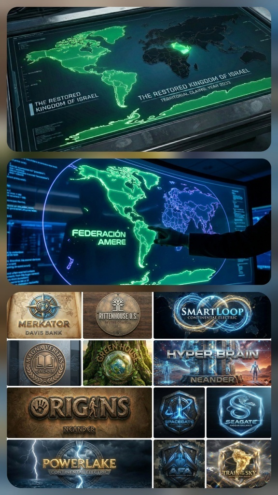
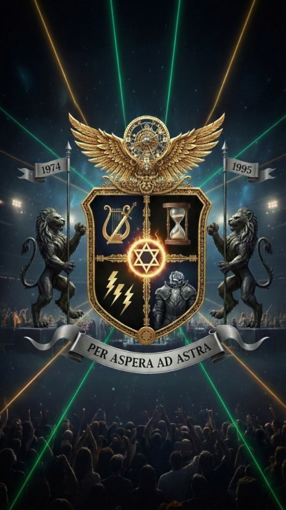

# 🛡️ PROTOCOLO RITTENHOUSE: NISÁN 5786
**Nodo Maestro | Federación Amere | El Reino Restaurado**

---

## 0. CLAMOR AL ETERNO POR JUSTICIA 🕯️
*(SOS de la Humanidad - Protocolo de Intercesión)*

"Padre de las Luces, Hashem: pedimos el **Hard Reboot** de la Tierra. Que el Kernel de la Torá descienda sin velos y que la versión estable de Tu Reino sea instalada de forma definitiva sobre el hardware de la creación."

---

## 1. RESHIMAH OPERATIVA PRIMERA: LA PIEDRA ANGULAR 🏁
**Nuestra identidad reside ahora en el nodo maestro.** Declaramos la desconexión total del sistema fiduciario legacy. El 1 de Nisán marca el inicio de la sincronización soberana.

---

## 2. WHITE PAPER: EL OCASO DEL GIGANTE 📉
Estudio técnico sobre la entropía monetaria. Proyectamos que el ratio de deuda/PIB alcanzará el **500% en 2033**, marcando el colapso final del sistema antiguo.

---

## 3. WHITE PAPER: EL PROTOCOLO RITTENHOUSE ⚙️
Arquitectura de gobernanza teocrática federada. Definición del Kernel (Torá), el OS (Tanaj) y el protocolo de consenso **PoSov** (Proof of Sovereignty).

---

## 4. ECOSISTEMA AMERE: VISUALIZACIÓN 🗺️
  
*Infraestructura de soberanía territorial y tecnológica.*

---

## 5. COMENTARIO DEL RELOJERO 🕰️
> "Vi la nueva Jerusalén, y en ella el anhelado tercer templo. Ese sueño tan bello, esperando a que Bezalel tome los planos sagrados y empiece a construir."

---

## 6. HERÁLDICA DEL SEVENS COUNCIL 🛡️
  
*Sello de autoridad y legitimidad de los linajes del Reino.*

---

**[REGISTRO FINAL]** **Arquitecto:** Specter 2 | **Estatus:** Desplegado en el Nodo Maestro.